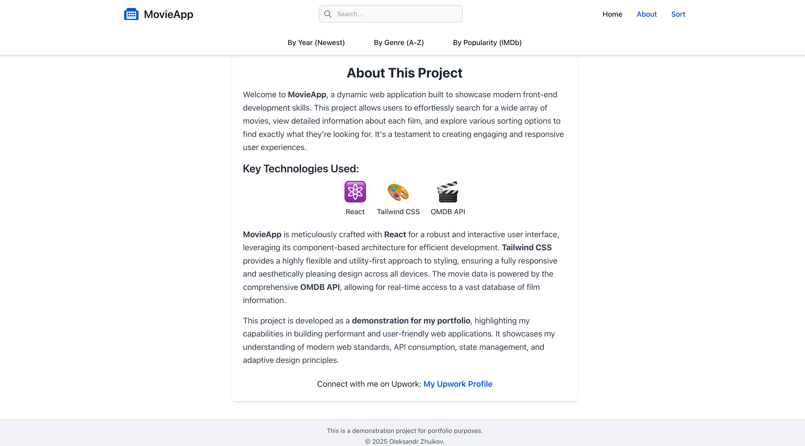

# 🎬 Movie Search App

This is a simple and clean movie search application built with **React**, **TailwindCSS**, and the **OMDb API**. You can enter a movie title and get a list of matching films with their posters and release years.

## 🔗 Live Demo

👉 [moviereactalexapp.netlify.app](https://moviereactalexapp.netlify.app)

## 📸 Screenshots

| Home screen | About screen |
|------------------|--------------|
|  |  |


---

## ⚙️ Tech Stack

- **React** – UI library
- **TailwindCSS** – for fast and modern styling
- **Vite** – lightweight dev server
- **OMDb API** – for fetching movie data

---

## 🚀 Features

- 🔍 Search for any movie by title
- 🎞️ View poster, title, and release year
- 🧱 Responsive layout for all devices
- ❌ "No results found" fallback
- 💨 Lazy loading for performance
- 📷 Placeholder for missing images

---

## 🛠️ Installation

```bash
git clone https://github.com/AlexanderKid/movie-search-react.git
cd movie-search-react
npm install
npm run dev